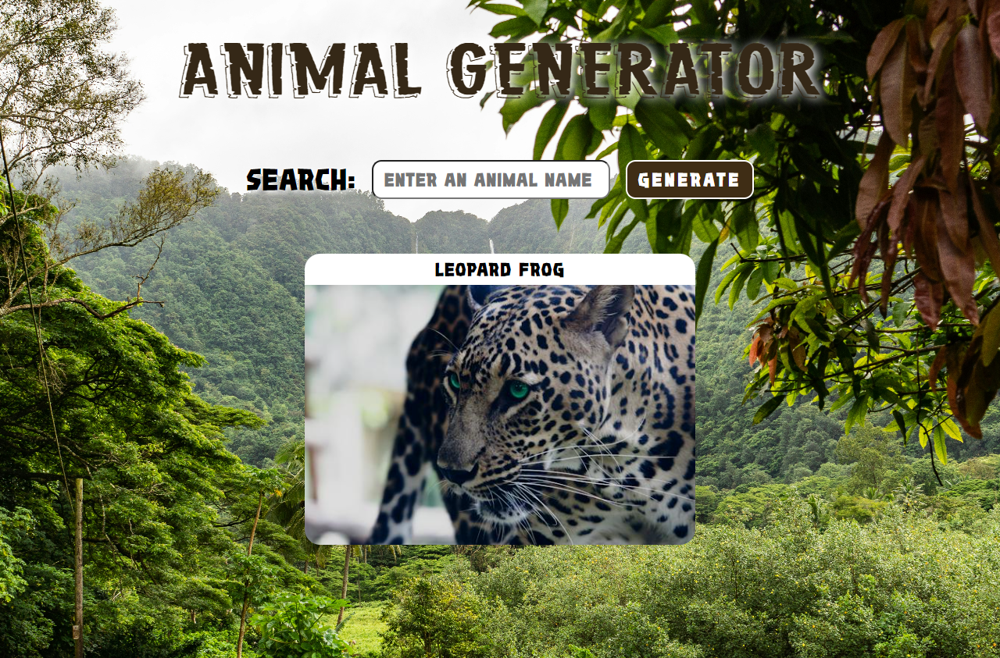

## Animal Generator

A web app build with Node.js, Express and APIs.

Lesson source: [Building a Node.js app](https://www.youtube.com/watch?v=wYALykLb5oY) by [Coder Coder](https://www.youtube.com/@TheCoderCoder). 

Special thanks to the professor!

NOTE: This project is an animal generator inspired by a coding tutorial. Due to the unavailability of APIs on RapidAPI used in the original video, I decided to create my own version using alternative APIs.

## To start the localhost

```bash
npm run dev
//or
npm run start
```
<br>
<picture>  </picture>